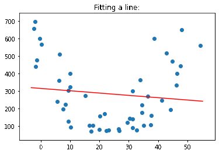

# Polynomial Regression
Polynomial regression algorithm from scratch.

### Demo:


## Key code:
```python
def sigma(numXs, numYs):
    res = 0
    for i in range(length):
        res += xs[i]**numXs * ys[i]**numYs
    return res

system = np.empty([n+1, n+1])
outputs = np.empty([n+1])
for i in range(n+1):
    outputs[i] = sigma(n - i, 1)
    for j in range(n+1):
        system[i][j] = sigma(2*n - j - i, 0)

coefs = list(np.linalg.inv(system).dot(outputs)) # solve system
```
where `xs` is the list of x values in the datapoints, `ys` is the list of y values, and `n` is the degree of the polynomial.
